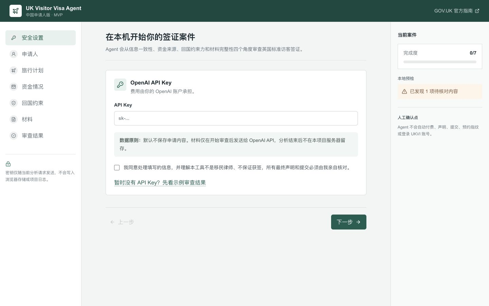
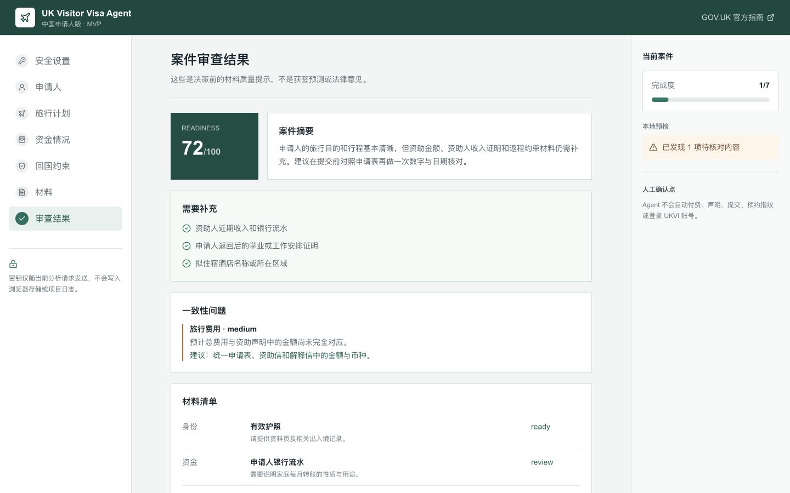

# UK Visitor Visa Agent
一生在办签证的猪肝红！

面向中国申请人的英国 Standard Visitor visa 材料准备 Agent。

它会带你从填写基本信息开始，检查日期、行程、资金和资助关系，读取上传的佐证材料，最后生成风险提示、材料清单和英文解释信草稿。

> [!IMPORTANT]
> 这是材料准备工具，不是移民律师，不预测或保证获签。付费、最终声明、提交和生物信息预约必须由申请人亲自完成。



## 一分钟上手

只需要记住这 6 步：

1. 在电脑上安装 [Node.js](https://nodejs.org/)。
2. 下载本项目，在项目文件夹中运行 `npm install`。
3. 运行 `npm run dev`，然后打开 [http://localhost:3000](http://localhost:3000)。
4. 输入自己的 OpenAI API Key，勾选数据处理确认。
5. 按左侧顺序填写信息并上传材料。
6. 点击“开始 AI 审查”，按结果补齐材料，再去 GOV.UK 亲自提交。

没有 API Key 也可以先点击首页的 **“暂时没有 API Key？先看示例审查结果”**，这不会调用 API，也不会产生费用。

## 使用前准备

| 需要准备 | 用来做什么 |
| --- | --- |
| Node.js 20 或更高版本 | 在电脑上运行网页 |
| OpenAI API Key | 调用 AI 读取和审查材料 |
| 护照和当地居留证明 | 填写申请人信息 |
| 拟定旅行日期、城市和住宿 | 生成可执行的行程说明 |
| 申请人和资助人的近期银行流水 | 核对资金来源与行程预算 |
| 在读、在职或其他回程约束材料 | 说明为什么会按时离开英国 |

API Key 会产生 OpenAI API 使用费用。这不是 ChatGPT 会员密码，也不是 UKVI 密码。

## 完整教程

### 第 1 步：下载并启动

会使用 Git 的用户：

```bash
git clone https://github.com/YaoSong808/uk-visitor-visa-agent.git
cd uk-visitor-visa-agent
npm install
npm run dev
```

不会使用 Git 的用户：

1. 在 GitHub 页面点击 **Code** → **Download ZIP**。
2. 解压 ZIP，打开解压后的文件夹。
3. 在该文件夹中打开终端。
4. 先输入 `npm install`，等待安装完成。
5. 再输入 `npm run dev`。
6. 看到 `Local: http://localhost:3000` 后，用浏览器打开该地址。

> [!TIP]
> 终端窗口必须保持打开。关掉终端后，网页也会停止运行。

### 第 2 步：输入 API Key

1. 登录 [OpenAI API Platform](https://platform.openai.com/)。
2. 在 API Keys 页面创建一个密钥。
3. 设置账单和使用限额，避免超出自己的预算。
4. 回到 Agent 首页，把密钥填入 `API Key` 输入框。
5. 阅读并勾选数据处理确认。

API Key 只应输入到你自己运行的页面。不要把密钥发给他人、截图公开，也不要写入 GitHub 代码。

### 第 3 步：填写申请信息

按左侧菜单从上到下填写：

1. **申请人**：按护照填姓名、出生日期和护照号。在香港或其他非国籍地申请时，填写当地合法身份有效期。
2. **旅行计划**：填写到达和离境日期、旅行目的、城市、活动和拟住宿地点。
3. **资金情况**：填写预计总费用、个人资金、每月收入支出和大额交易。
4. **资助人**：如由父母或他人支付，填写姓名、关系、资助金额和收入。
5. **回国约束**：填写学校、单位、毕业、开学、工作或其他可证明的返程安排。

数字和日期必须与最终 UKVI 申请表、流水、资助信和解释信保持一致。不知道的内容先留空，不要猜测。

### 第 4 步：上传材料

进入 **材料** 页面，点击上传区域，选择 PDF、JPG 或 PNG。

- 每次最多 8 份材料。
- 每份不超过 10 MB。
- 建议文件名直接说明内容，例如 `Applicant_Bank_Statement.pdf`。
- 不是英文或威尔士文的材料，通常需要可独立验证的完整翻译。

**绝对不要上传：** UKVI 密码、短信验证码、银行密码、信用卡完整信息或其他账号登录凭证。

### 第 5 步：开始审查

1. 进入 **审查结果**。
2. 先看本地预检提示，修正明显的日期或金额问题。
3. 点击 **开始 AI 审查**。
4. 等待 Agent 读取材料并生成结果。

Readiness 分数只表示信息和材料完整度，**不是获签概率**。



### 第 6 步：根据结果补材料

按以下顺序处理：

1. **需要补充**：补齐缺少的信息或证明。
2. **一致性问题**：核对金额、币种、日期、姓名、资助关系和账户归属。
3. **材料清单**：处理 `missing` 和 `review` 状态的项目。
4. **解释信初稿**：替换所有 `[TO CONFIRM: ...]`，删除无法用材料证明的句子。
5. 修改资料后重新运行审查，直到主要矛盾都已解决。

### 第 7 步：导出并亲自提交

点击 **下载案件 JSON** 保留本次审查结果。

然后前往 [GOV.UK Standard Visitor visa 申请页](https://www.gov.uk/standard-visitor/apply-standard-visitor-visa)，由申请人亲自：

1. 创建或登录 UKVI 申请。
2. 核对并填写最终申请表。
3. 完成声明和付费。
4. 按指引上传材料。
5. 预约并前往签证申请中心提供生物信息。

## 常见问题

### 没有 API Key 能用吗？

可以填表和使用本地预检，也可以查看内置示例结果。真正读取材料和生成个性化审查需要 API Key。

### 会自动提交签证吗？

不会。应用不收集 UKVI 账号密码，不自动付费、声明、提交或预约生物信息。

### 上传的材料会保存吗？

当前 MVP 没有数据库，不会由应用代码写入磁盘。材料会在用户点击 AI 审查后随当前请求发送给 OpenAI API，请同时阅读 OpenAI 适用于自己账户的数据政策。

### 这个工具适用于所有英国签证吗？

不适用。当前只面向英国 Standard Visitor visa 材料准备，不应用于工作、学生、家庭、定居或庇护类申请。

## 开发与验证

可选地通过环境变量调整模型：

```bash
OPENAI_MODEL=gpt-5.4 npm run dev
```

运行全部检查：

```bash
npm test
npm run lint
npm run build
```

## 安全边界

- API Key 不写入 localStorage、Cookie 或项目日志。
- OpenAI 请求设置 `store: false`。
- 应用不使用数据库，不保存上传材料。
- 部署给第三方使用前，必须增加用户隔离、身份验证、限流、恶意文件检测、隐私政策和数据保留政策。

详细威胁模型见 [SECURITY.md](SECURITY.md)。

## 官方依据

- [Apply for a Standard Visitor visa](https://www.gov.uk/standard-visitor/apply-standard-visitor-visa)
- [Visiting the UK: supporting documents](https://www.gov.uk/government/publications/visitor-visa-guide-to-supporting-documents/guide-to-supporting-documents-visiting-the-uk)
- [UKVI account terms and conditions](https://www.gov.uk/government/publications/ukvi-account-terms-and-conditions/ukvi-account-terms-and-conditions)
- [OpenAI Responses API](https://developers.openai.com/api/reference/typescript/resources/beta/subresources/responses/methods/create)

签证费用、处理时间、文件要求和申请流程会变化。提交前应以 GOV.UK 当日内容为准。

## 许可证

MIT
